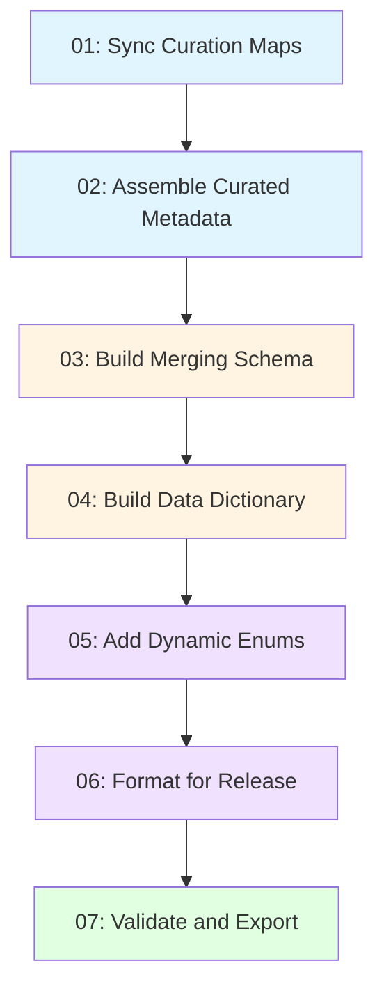

# curatedMetagenomicData ETL Pipeline

## Overview

This directory contains the automated ETL (Extract, Transform, Load) pipeline for the curatedMetagenomicData project. The pipeline orchestrates the curation, harmonization, and validation of metadata from metagenomic studies.

## Quick Start

### Prerequisites

- R >= 4.0.0
- Required R packages: `readr`, `dplyr`, `yaml`, `googlesheets4`, `googledrive`
- Optional: `logger`, `jsonlite`, `testthat`

### Installation

```r
# Install required packages
install.packages(c("readr", "dplyr", "yaml", "googlesheets4", "googledrive", 
                   "logger", "jsonlite", "testthat"))

# Install OmicsMLRepo packages
remotes::install_github("waldronlab/OmicsMLRepoR")
remotes::install_github("waldronlab/OmicsMLRepoCuration")
```

### Running the Pipeline

**Run all steps:**
```bash
Rscript curatedMetagenomicData/ETL/run_etl_pipeline.R
```

**Run specific steps:**
```bash
# Run only sync and assembly steps
Rscript curatedMetagenomicData/ETL/run_etl_pipeline.R --steps "01,02"

# Run by step name
Rscript curatedMetagenomicData/ETL/run_etl_pipeline.R --steps "sync_curation_maps,assemble_curated_metadata"
```

**Validation only:**
```bash
Rscript curatedMetagenomicData/ETL/run_etl_pipeline.R --validate-only
```

**Custom configuration:**
```bash
Rscript curatedMetagenomicData/ETL/run_etl_pipeline.R --config my_config.yaml
```

## Pipeline Steps



### Step Descriptions

1. **01_sync_curation_maps.R** - Downloads curation maps from Google Sheets
2. **02_assemble_curated_metadata.R** - Combines curated data files into single table
3. **03_build_merging_schema.R** - Creates schema mapping original to curated columns
4. **04_build_data_dictionary.R** - Builds comprehensive data dictionary
5. **05_add_dynamic_enums.R** - Adds dynamic enumeration nodes for ontology terms
6. **06_format_for_release.R** - Formats data for user-facing release
7. **07_validate_and_export.R** - Validates outputs and syncs to all targets

## Configuration

The pipeline is configured via `config.yaml`. Key sections:

### Paths
```yaml
paths:
  project_dir: "~/OmicsMLRepo/OmicsMLRepoData"
  etl_dir: "curatedMetagenomicData/ETL"
  maps_dir: "curatedMetagenomicData/maps"
  output_dir: "inst/extdata"
```

### Google Sheets
```yaml
google_sheets:
  curation_maps_url: "https://docs.google.com/..."
  merging_schema_url: "https://docs.google.com/..."
```

### Sync Targets
```yaml
sync_targets:
  - name: "OmicsMLRepoCuration"
    path: "~/OmicsMLRepo/OmicsMLRepoCuration/inst/extdata"
  - name: "OmicsMLRepoR"
    path: "~/OmicsMLRepo/OmicsMLRepoR/inst/extdata"
```

## Directory Structure

```
curatedMetagenomicData/ETL/
├── config.yaml                    # Configuration file
├── run_etl_pipeline.R            # Master orchestrator
├── 01_sync_curation_maps.R       # Step 1 script
├── 02_assemble_curated_metadata.R # Step 2 script
├── 03_build_merging_schema.R     # Step 3 script
├── 04_build_data_dictionary.R    # Step 4 script
├── 05_add_dynamic_enums.R        # Step 5 script
├── 06_format_for_release.R       # Step 6 script
├── 07_validate_and_export.R      # Step 7 script
├── R/
│   ├── config_loader.R           # Configuration management
│   ├── validation.R              # Validation functions
│   ├── provenance.R              # Provenance tracking
│   ├── utils/                    # Utility functions
│   │   ├── logging_helpers.R
│   │   ├── data_helpers.R
│   │   ├── ontology_helpers.R
│   │   └── validation_helpers.R
│   └── dictionary_builders/      # Dictionary builder modules
│       └── README.md
├── logs/                         # Execution logs (created at runtime)
├── README.md                     # This file
├── ARCHITECTURE.md               # System architecture
├── RUNBOOK.md                    # Detailed procedures
└── TROUBLESHOOTING.md            # Common issues and solutions
```

## Outputs

The pipeline produces the following files in `inst/extdata/`:

- `cMD_curated_metadata_all.csv` - Complete curated metadata
- `cMD_curated_metadata_release.csv` - User-facing release version
- `cMD_merging_schema.csv` - Column mapping schema
- `cMD_data_dictionary.csv` - Data dictionary
- `cMD4_data_dictionary.csv` - Expanded data dictionary

## Logging and Monitoring

Logs are written to `curatedMetagenomicData/ETL/logs/`:

- Execution logs: `etl_pipeline_YYYYMMDD_HHMMSS.log`
- Validation reports: `validation_report_YYYYMMDD_HHMMSS.txt`
- Execution reports: `execution_report_YYYYMMDD_HHMMSS.txt`
- Provenance logs: `provenance_STEPNAME_YYYYMMDD_HHMMSS.json`

## GitHub Actions

The pipeline can be automated via GitHub Actions (`.github/workflows/etl-pipeline.yml`):

- **Scheduled**: Runs weekly on Mondays at 2am UTC
- **Manual**: Trigger via GitHub Actions UI with custom parameters
- **Artifacts**: Logs and reports uploaded as build artifacts

## Validation

The pipeline includes comprehensive validation:

- **Schema validation**: Checks required columns and data types
- **Ontology validation**: Verifies ontology ID formats
- **Completeness checks**: Ensures critical fields are populated
- **Duplicate detection**: Identifies duplicate entries
- **Cross-validation**: Verifies consistency between related files

Run validation independently:
```bash
Rscript curatedMetagenomicData/ETL/run_etl_pipeline.R --validate-only
```

## Testing

Run the test suite:
```bash
# Run all tests
Rscript -e 'testthat::test_dir("tests/testthat")'

# Run specific test file
Rscript -e 'testthat::test_file("tests/testthat/test-etl.R")'
```

## Troubleshooting

See `TROUBLESHOOTING.md` for common issues and solutions.

Quick tips:
- Check logs in `curatedMetagenomicData/ETL/logs/`
- Verify Google Sheets authentication
- Ensure all paths in config.yaml are correct
- Check that required R packages are installed

## Contributing

When adding new attributes or modifying the pipeline:

1. Update curation maps in Google Sheets
2. Add dictionary entries in appropriate `dictionary_builders/` module
3. Update configuration in `config.yaml` if needed
4. Add tests in `tests/testthat/test-etl.R`
5. Update documentation

## Support

For questions or issues:
- Check `TROUBLESHOOTING.md`
- Review `ARCHITECTURE.md` for system design
- Consult `RUNBOOK.md` for step-by-step procedures
- Open an issue on GitHub

## License

See main repository LICENSE file.

## References

- Main documentation: `curatedMetagenomicData/cMD_ETL.qmd`
- System architecture: `ARCHITECTURE.md`
- Detailed procedures: `RUNBOOK.md`
- OmicsMLRepo project: https://github.com/waldronlab
